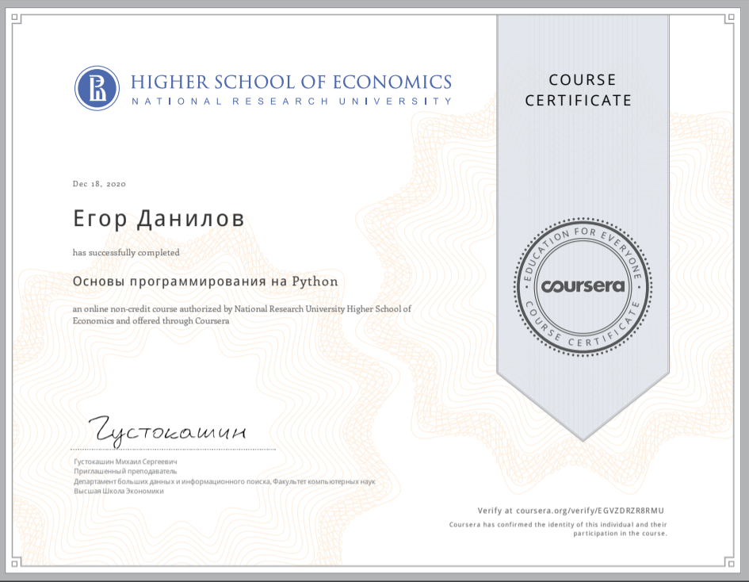

# coursera_python_programming

В результате освоения курса слушатели научатся обрабатывать и хранить числа, тексты и их наборы, освоят стандартную библиотеку языка Python и смогут автоматизировать задачи по сбору и обработке данных. Курс дает необходимую базу для освоения более специализированных областей применения языка Python, таких как машинное обучение, статистическая обработка данных, визуализация данных и многих других. Также слушатели познакомятся с основами различных парадигм программирования: процедурным, функциональным и объектно-ориентированным программированием.
